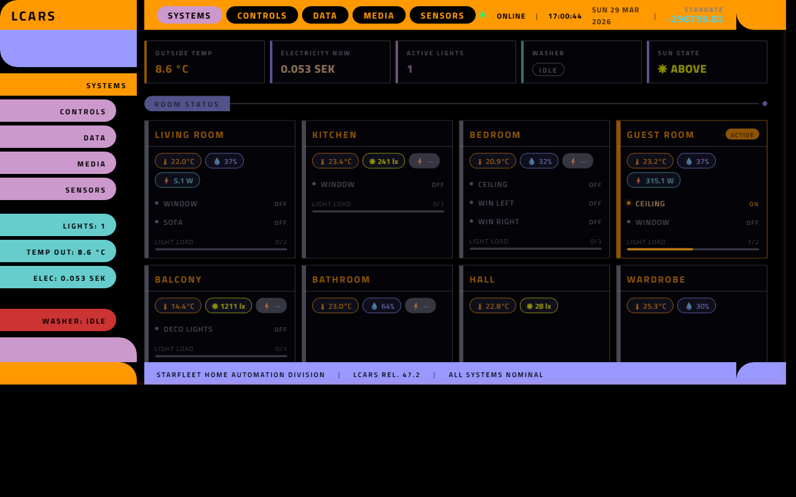
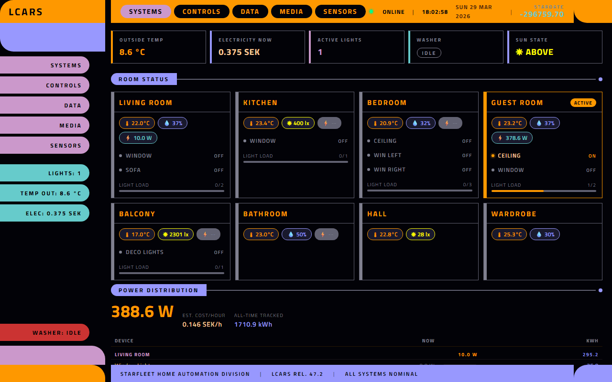
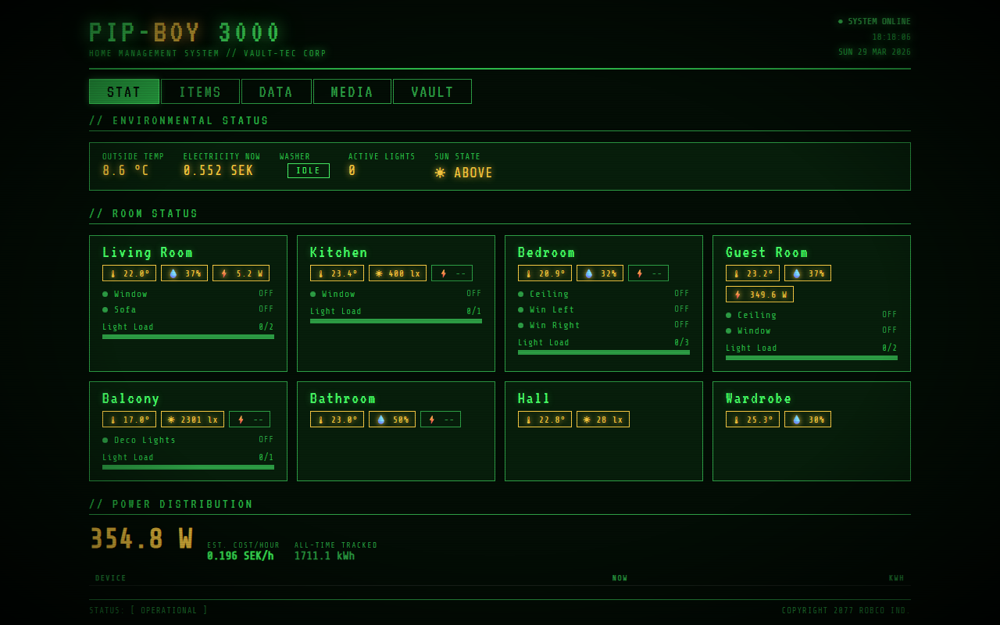
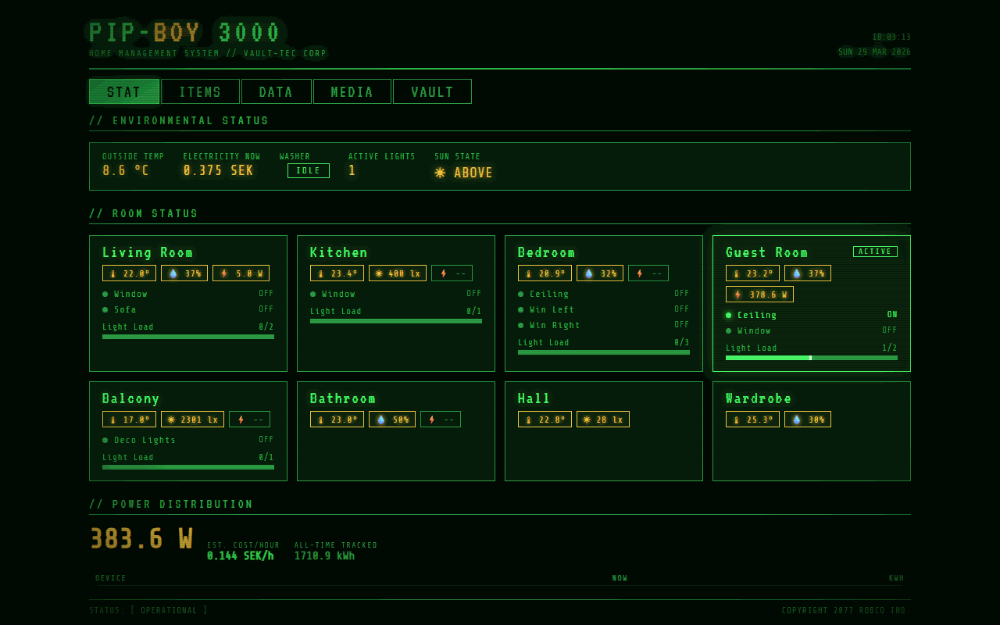
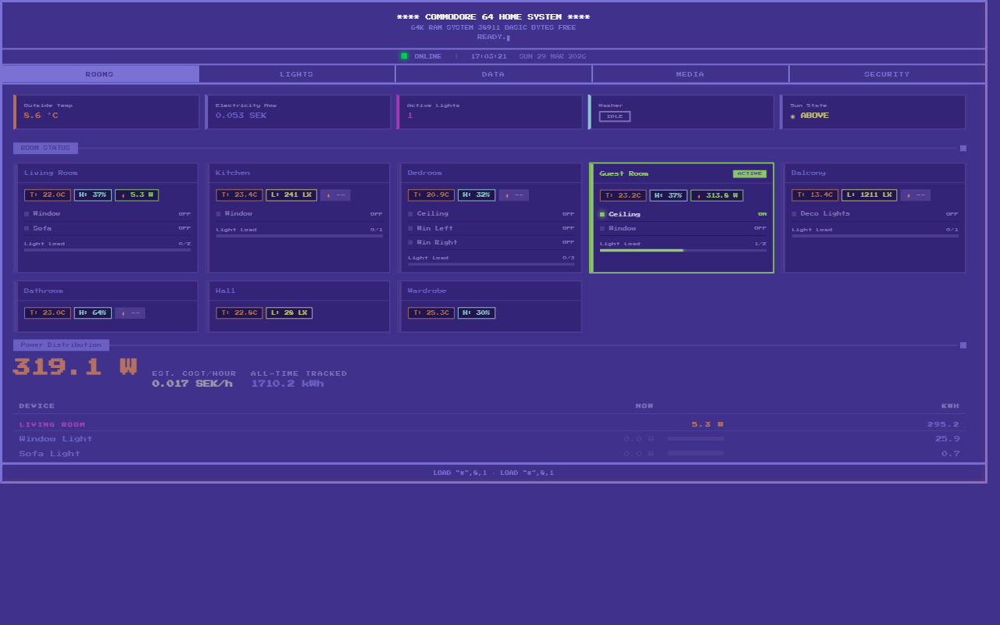
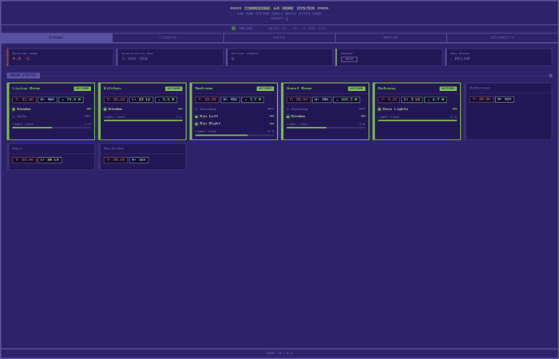
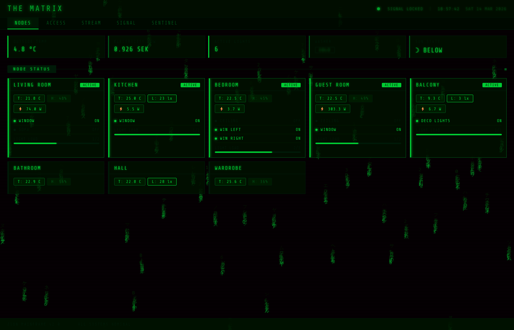
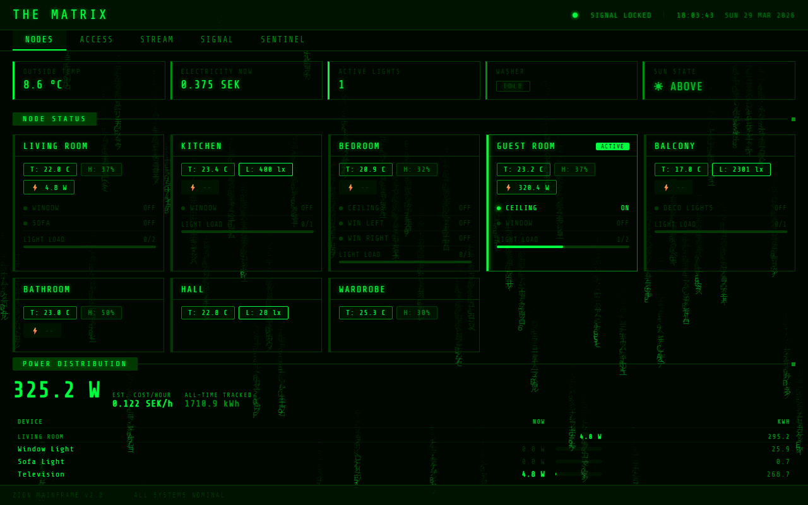
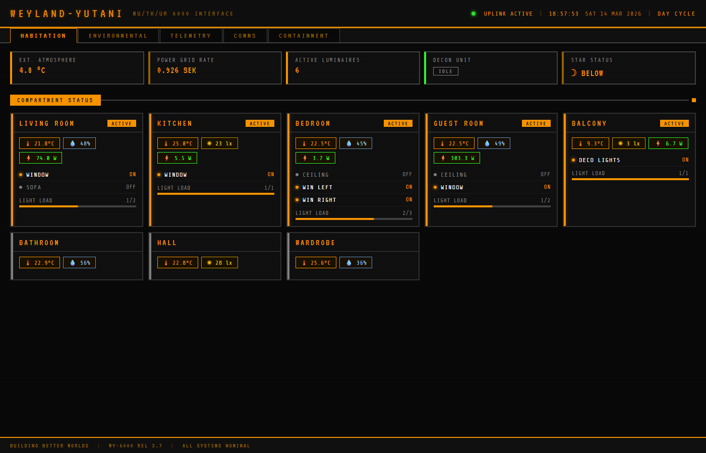

# Home Assistant Themed Dashboards

Five themed HTML dashboards for Home Assistant, sharing a common JavaScript core (`shared.js`) with theme-specific styling and hooks. All dashboards provide real-time room monitoring, light controls, energy tracking, media players, and sensor data — presented through different aesthetic lenses.

## Themes

| Theme | File | Inspired By |
|-------|------|-------------|
| **LCARS** | `lcars-dashboard.html` | Star Trek computer interface |
| **Pip-Boy 3000** | `pipboy-dashboard.html` | Fallout series Pip-Boy |
| **Commodore 64** | `c64-dashboard.html` | Commodore 64 home computer |
| **Matrix** | `matrix-dashboard.html` | The Matrix digital rain |
| **Weyland-Yutani** | `weyland-dashboard.html` | Alien franchise MU/TH/UR 6000 |

### LCARS — Star Trek



### Pip-Boy 3000 — Fallout



### Commodore 64



### Matrix



### Weyland-Yutani — Alien



### Theme-Specific Extras
- **LCARS**: Animated radar sweep on the Sensors tab with randomized blip contacts
- **Pip-Boy**: Geiger counter that ticks based on ambient lux, plus a threat assessment panel
- **C64**: BASIC-style system log on the Security tab that logs events as numbered BASIC lines
- **Matrix**: Digital rain canvas background that responds to total power usage and slows at night
- **Weyland**: MOTHER AI status readout panel showing atmospheric, life support, and power diagnostics

## Quick Start

### 1. Create your config file

```bash
cp config.js.example config.js
```

Edit `config.js` with your Home Assistant details:

```js
const HA_HOST  = 'homeassistant.local:8123';   // Your HA hostname:port
const HA_TOKEN = 'YOUR_LONG_LIVED_ACCESS_TOKEN'; // Generate in HA → Profile → Long-Lived Access Tokens
```

### 2. Copy files to Home Assistant

Copy all `.html` files, `shared.js`, and `config.js` to your Home Assistant `www` folder:

```
/config/www/
├── config.js              ← Your secrets (not shared)
├── shared.js              ← Common JS (all dashboards need this)
├── lcars-dashboard.html
├── pipboy-dashboard.html
├── c64-dashboard.html
├── matrix-dashboard.html
└── weyland-dashboard.html
```

### 3. Access the dashboards

Open any dashboard in your browser:

```
http://homeassistant.local:8123/local/lcars-dashboard.html
```

## Configuration

### config.js

The only file you need to edit. Contains your connection settings:

| Variable | Description | Example |
|----------|-------------|---------|
| `HA_HOST` | Home Assistant hostname and port | `homeassistant.local:8123` |
| `HA_TOKEN` | Long-lived access token | Generate in HA → Profile → Security → Long-Lived Access Tokens |
| `HA_WS` | WebSocket URL (auto-derived) | `ws://homeassistant.local:8123/api/websocket` |
| `HA_BASE` | HTTP base URL (auto-derived) | `http://homeassistant.local:8123` |

> **Security**: `config.js` contains your access token and is listed in `.gitignore`. Never commit it. Share `config.js.example` instead.

### THEME object

Each dashboard defines a `THEME` constant in an inline `<script>` block that controls display strings, element mappings, and callback hooks:

```js
const THEME = {
  title: 'LCARS',                          // Header title
  subtitle: 'HOME AUTOMATION SYSTEM',      // Header subtitle
  footer: 'STARFLEET HOME AUTOMATION...',  // Footer text
  tabs: ['SYSTEMS', 'CONTROLS', ...],      // Tab labels
  tabIds: ['systems', 'controls', ...],    // Tab page IDs
  emptyMedia: 'No Active Transmissions',   // Shown when no media is playing
  connOnline: 'ONLINE',                    // Connection status labels
  connOffline: 'OFFLINE',
  connConnecting: 'CONNECTING',
  connToast: 'LCARS UPLINK ESTABLISHED',   // Toast shown on connect
  footerOnline: 'ALL SYSTEMS NOMINAL',     // Footer status messages
  footerConnecting: 'ESTABLISHING UPLINK...',
  footerOffline: 'UPLINK FAILURE — RETRYING',
  // Sensor formatting
  sensors: { temp: {icon:'🌡 ', unit:'°C'}, hum: {icon:'💧 ', unit:'%'}, lux: {icon:'☀ ', unit:' lx'} },
  dimmerColors: { fill: '--orange', bg: '--grey' },
  // Element ID mappings
  clockEl: 'clock-lcars',
  dateEl: 'date-lcars',
  lightCountEls: ['stat-lights', 'sb-lights'],
  nightToast: 'DECK LIGHTS — STANDBY',
  toastArrow: '→',
  // Callback hooks (optional)
  onInit() { /* runs after shared.js loads */ },
  onStatesLoaded() { /* runs after initial get_states */ },
  onIngest(id, s) { /* runs per state change */ },
};
```

Edit these values to customize text, formatting, and behavior without touching shared logic.

## Dashboard Structure

Each dashboard is an HTML file with inline CSS and a `THEME` config, plus `shared.js` for all common logic. No build tools needed.

### Script Load Order

```html
<script src="config.js"></script>     <!-- HA connection secrets -->
<script>
  const THEME = { ... };              <!-- Theme config + hooks -->
  // Theme-specific functions (e.g. renderLrs, initRain, renderMother)
</script>
<script src="shared.js"></script>     <!-- All shared logic -->
```

Theme-specific functions can reference `shared.js` globals (`liveData`, `rooms`, etc.) because they are defined but not called until after `shared.js` loads.

### Tabs (5 per dashboard)

| Tab | Content |
|-----|---------|
| **Systems/Rooms** | Room cards with temperature, humidity, lux, power usage (W), light on/off counts |
| **Controls/Lights** | Light toggle switches with dimmer sliders for supported lights, plus "all lights off" button |
| **Data** | Weather forecast, Nordpool electricity price charts (48h + bar chart), temperature history graph |
| **Media** | Plex session details (active streams, bandwidth, transcoding), Sonos/Apple TV now playing with album art and progress bars |
| **Sensors** | Energy consumption vs. price, washer panel (live status + monthly stats), plus theme-specific unique panels |

### Room Configuration

Rooms are defined in the `rooms` array. Each room object:

```js
{
  id: 'livingroom',
  name: 'Living Room',
  sensors: {
    temp: 'sensor.livingroomwindow_temperature',    // Temperature entity ID
    humidity: 'sensor.livingroomwindow_humidity',    // Humidity entity ID (null if none)
    lux: null                                        // Illuminance entity ID (null if none)
  },
  lights: [
    { id: 'light.livingroomwindow', label: 'Window' },
    { id: 'light.livingroomsofa', label: 'Sofa' }
  ],
  powerSensors: [                                    // Power consumption entities
    'sensor.livingroomwindow_power',
    'sensor.livingroomsofa_power',
    'sensor.livingroomwallplugtelevision_power'
  ]
}
```

### Adding a Room

1. Add a room object to the `rooms` array in `shared.js`
2. Add any new light entity IDs to `LIGHT_ENTITIES` in `shared.js`
3. Add any new sensor entity IDs to `ALL_SENSOR_IDS` in `shared.js`
4. Add power sensor initial values to `liveData.power` in `shared.js`

### Adding a Light

1. Add the entity ID to the room's `lights` array with a label
2. Add it to `LIGHT_ENTITIES` in `shared.js`
3. If dimmable, add it to the `DIMMABLE` Set in `shared.js`

### Media Players

Media players are defined in `MEDIA_PLAYER_ENTITIES` in `shared.js`:

```js
const MEDIA_PLAYER_ENTITIES = [
  { id: 'media_player.livingroom',   label: 'Living Room',  type: 'SONOS' },
  { id: 'media_player.kitchen',      label: 'Kitchen',      type: 'SONOS' },
  { id: 'media_player.bathroom',     label: 'Bathroom',     type: 'SONOS' },
  { id: 'media_player.livingroomtv', label: 'Living Room',  type: 'ATV' },
];
```

The media tab combines Plex sessions (via `sensor.plex_*` entities) with these media players under a unified "Now Playing" section. "No transmission" only shows when neither Plex, Sonos, nor Apple TV are active.

## Entity Reference

### Required Entities

These Home Assistant entities must exist for full functionality:

**Environment:**
- `sensor.openweathermap_temperature` — Outside temperature
- `weather.openweathermap` — Weather forecast

**Nordpool (electricity prices):**
- `sensor.nordpool_current_price_15m` — Current price (displayed in status bar)
- `sensor.nordpool_last_this_next_hour` — Last/current/next hour prices
- `sensor.nordpool_next_24h_15m` — 48h price forecast for charts
- These are from the standard [Nordpool HA integration](https://www.home-assistant.io/integrations/nordpool/). Entity names vary by setup — adjust in the `ingestState()` function if yours differ

**Sun:**
- `sun.sun` — Day/night state (drives night mode)

**Plex:**
- `sensor.plex_*` — Plex media server sensors

**Washer (Samsung SmartThings):**
- `sensor.washer_job_state` — Current cycle phase (wash, rinse, spin, finish, none)
- `sensor.washer_machine_state` — Machine state (run, stop, pause)
- `sensor.washer_completion_time` — ETA timestamp
- `select.washer_water_temperature` — Selected wash temperature
- `select.washer_spin_level` — Selected spin speed (RPM)
- `number.washer_rinse_cycles` — Number of rinse cycles
- `sensor.washer_power` — Real-time power draw (W)
- `sensor.washer_energy` — Lifetime energy (kWh, used for monthly statistics)
- `sensor.washer_water_consumption` — Lifetime water (L, used for monthly statistics)
- `sensor.washer_cycle_count` — Wash cycle counter (requires counter helper + automation, see below)

**Washer cycle counting setup (required for per-month cycle stats):**

The Samsung SmartThings integration does not expose a cycle counter entity. To track how many wash cycles have run per month/year, you need to create three things in Home Assistant: a **counter helper**, a **template sensor**, and an **automation**. Without these, the washer panel will still show live status, energy, and water stats — but the "cycles" column in the monthly breakdown will be missing.

**Step 1 — Counter helper** (`configuration.yaml`)

Add a top-level `counter:` block (not inside any other block). This stores the raw count and persists across restarts:

```yaml
counter:
  washer_cycles:
    name: Washer Cycles
    initial: 0
    step: 1
```

**Step 2 — Template sensor** (`configuration.yaml`)

Add this inside your existing `template:` → `sensor:` block. The `state_class: total_increasing` is critical — it tells HA's recorder to track long-term statistics (monthly/yearly totals), which is what the dashboard reads via `recorder/statistics_during_period`:

```yaml
template:
  - sensor:
      - name: "Washer Cycle Count"
        unique_id: washer_cycle_count
        state: "{{ states('counter.washer_cycles') | int(0) }}"
        state_class: total_increasing
        unit_of_measurement: "cycles"
```

> If you already have a `template:` block, just add the sensor entry to the existing `sensor:` list — don't duplicate the `template:` key.

**Step 3 — Automation** (via UI or `automations.yaml`)

This increments the counter each time the washer enters the `wash` phase. The condition prevents double-counting if the state bounces:

```yaml
- alias: "Count washer cycles"
  trigger:
    - platform: state
      entity_id: sensor.washer_job_state
      to: "wash"
  condition:
    - condition: template
      value_template: "{{ trigger.from_state.state != 'wash' }}"
  action:
    - service: counter.increment
      target:
        entity_id: counter.washer_cycles
```

**Step 4 — Restart Home Assistant**

A full restart is required (not just "Reload YAML") because counter entities are only created at boot. After restart, verify both entities exist in **Developer Tools → States**:
- `counter.washer_cycles` — should show `0`
- `sensor.washer_cycle_count` — should show `0` with `state_class: total_increasing`

> **Note**: Statistics data starts accumulating from the moment the template sensor is created. Historical cycles before setup are not retroactively counted.

**Power (per-room):**
- `sensor.*_power` — Smart plug power sensors

### Rooms (Default Configuration)

| Room | Lights | Sensors | Power Sensors |
|------|--------|---------|---------------|
| Living Room | Window, Sofa | Temp, Humidity | 3 plugs |
| Kitchen | Window | Temp, Lux | 1 plug |
| Bedroom | Ceiling*, Win Left, Win Right | Temp, Humidity | 3 plugs |
| Guest Room | Ceiling*, Window | Temp, Humidity | 3 plugs |
| Balcony | Deco Lights | Temp, Lux | 1 plug |
| Bathroom | — | Temp, Humidity | — |
| Hall | — | Temp, Lux | — |
| Wardrobe | — | Temp, Humidity | — |

\* = Dimmable

## Features

### Night Mode

All dashboards respond to `sun.sun` state. When the sun is below the horizon:
- **LCARS**: Sidebar and bars shift to cooler purple/blue tones
- **Pip-Boy**: Subtle scanline and flicker adjustments
- **C64**: Semi-transparent dark overlay
- **Matrix**: Green palette dims, rain speed halves
- **Weyland**: Header shows "NIGHT WATCH" instead of "DAY CYCLE"

### "All Lights Off" Button

Each dashboard has a themed button on the Controls/Lights tab that turns off all lights except the Balcony:

| Theme | Button Label |
|-------|-------------|
| LCARS | DECK LIGHTS — STANDBY |
| Pip-Boy | VAULT CURFEW |
| C64 | POKE >D020,00 |
| Matrix | DISCONNECT NODES |
| Weyland | CREW HIBERNATION |

### Washer Panel

The Sensors tab includes a washer status panel powered by Samsung SmartThings entities. It shows:

- **Live status**: current cycle phase with progress indicator (e.g. WASH → RINSE → SPIN)
- **ETA countdown**: time remaining and estimated completion time
- **Cycle settings**: temperature, spin speed, rinse count, power draw
- **Monthly statistics**: energy (kWh) and water (L) bar charts per month, grouped by year
- **Yearly totals**: cumulative energy and water per year
- **Lifetime totals**: all-time energy and water consumption

Monthly and yearly stats use HA's `recorder/statistics_during_period` API, which keeps long-term data indefinitely.

Each theme uses its own labels:

| Theme | Panel Title | Phase Names |
|-------|------------|-------------|
| LCARS | TEXTILE RECYCLER | SCAN → WASH → RINSE → SPIN → COMPLETE |
| Pip-Boy | DECON UNIT | DETECT → WASH → RINSE → SPIN → CLEAR |
| C64 | WASHER 1541-W | LOAD → WASH → RINSE → SPIN → READY. |
| Matrix | CLEANSER | SENSE → PURIFY → FLUSH → EXTRACT → EXIT |
| Weyland | DECON BAY 3 | WEIGH → DECON → RINSE → EXTRACT → SECURED |

Customize labels via `THEME.washer` in each dashboard's inline script.

### Theme Switcher & Fullscreen

Click the **lower-left corner** of any dashboard to reveal:
- **Theme switcher** — links to all 5 dashboards
- **Fullscreen toggle** — uses the browser Fullscreen API

The controls auto-hide after 20 seconds of inactivity.

### PWA / Add to Home Screen

All dashboards include `mobile-web-app-capable` meta tags. On mobile:
1. Open the dashboard in Chrome
2. Menu → "Add to Home Screen"
3. The dashboard launches without browser chrome

### Accessibility (WCAG 2.2 AA)

- Skip-to-content link on all dashboards
- `role="tablist"` and `aria-selected` on navigation tabs
- Keyboard-navigable tabs
- `focus-visible` outlines on all interactive elements
- `aria-live="polite"` on toast notifications
- `prefers-reduced-motion` media query disables animations

## Adapting for Your Home

### Step-by-step

1. **Copy `config.js.example` to `config.js`** — add your HA host and token
2. **Edit room config** — update the `rooms` array with your entity IDs
3. **Edit light entities** — update `LIGHT_ENTITIES` and `DIMMABLE`
4. **Edit media players** — update `MEDIA_PLAYER_ENTITIES` with your Sonos/ATV entities
5. **Edit power sensors** — update `powerSensors` arrays and `liveData.power` initial values
6. **Edit sensor IDs** — update `ALL_SENSOR_IDS` to include all entities you want to subscribe to
7. **Customize THEME** — change tab names, titles, and status messages

### Creating a New Theme

1. Copy any existing dashboard HTML file
2. Update the CSS variables in `:root { }` for your color scheme
3. Change fonts (loaded via Google Fonts `@import`)
4. Edit the `THEME` object for your labels, sensor formatting, element IDs, and hooks
5. Add theme-specific functions (e.g. custom animations, unique panels)
6. Modify the HTML header/footer structure
7. Update the `.active` class in the theme switcher menu

## File Structure

```
├── config.js              ← Your HA connection (gitignored)
├── config.js.example      ← Template for config.js
├── shared.js              ← Common JS: entities, state, render, WS, init
├── .gitignore             ← Excludes config.js
├── lcars-dashboard.html   ← Star Trek LCARS theme
├── pipboy-dashboard.html  ← Fallout Pip-Boy theme
├── c64-dashboard.html     ← Commodore 64 theme
├── matrix-dashboard.html  ← Matrix digital rain theme
├── weyland-dashboard.html ← Alien Weyland-Yutani theme
└── README.md              ← This file
```

## Technical Details

### How It Works

`shared.js` connects to Home Assistant via **WebSocket API** (`ws://host:port/api/websocket`). On connection:

1. Authenticates with the long-lived access token
2. Subscribes to all entity state changes
3. Fetches initial states for all configured entities
4. Renders the UI and updates in real-time as states change

All state is tracked in a `liveData` object that maps entity IDs to their current values. Render functions read from `liveData` and update the DOM.

### Key Functions (in shared.js)

| Function | Purpose |
|----------|---------|
| `haConnect()` | Establishes WebSocket connection with auto-reconnect |
| `ingestState(s)` | Maps a HA state object into `liveData` |
| `renderRooms()` | Renders room cards with sensors, lights, and power |
| `renderMedia()` | Renders Plex sessions |
| `renderMediaPlayers()` | Renders Sonos/ATV players |
| `updateNoMediaMsg()` | Shows/hides "no media" message |
| `renderEnviro()` | Renders environment status bar |
| `renderWeather()` | Renders weather forecast cards |
| `renderNordpool48h()` | Renders 48-hour electricity price chart |
| `renderTempGraph()` | Renders temperature history sparkline |
| `renderLcEnergy()` | Renders energy consumption vs price |
| `renderWasher()` | Renders washer panel: live status, phase progress, monthly stats |
| `toggleLight(id, on)` | Toggles a light and calls HA service |
| `dimLight(id, value)` | Sets brightness and calls HA service |
| `nightProtocol()` | Turns off all lights except Balcony |
| `updateDayNight()` | Toggles night-mode CSS class based on sun state |
| `setConnStatus(s)` | Updates connection status display |
| `showToast(msg)` | Shows temporary notification |

### Performance Notes

- **Matrix rain**: Uses `setTimeout` at 150ms intervals (~6-7 fps) instead of `requestAnimationFrame` for minimal CPU usage
- **Canvas animations** (LCARS radar, C64 scanlines): Disabled automatically when `prefers-reduced-motion` is set
- All dashboards run entirely client-side with no external dependencies beyond Google Fonts

## License

MIT
