# Home Assistant Themed Dashboards

Seven themed HTML dashboards for Home Assistant, sharing a common JavaScript core (`shared.js`) with theme-specific styling and hooks. All dashboards provide real-time room monitoring, light controls, energy tracking, media players, and sensor data — presented through different aesthetic lenses.

### Get Running

> **Tip — enable Dev Mode while setting up**: In `config.js`, set `DEV_MODE = true`. This adds a cache-busting parameter to every page load, so the browser always fetches your latest changes to `entities.js`, `shared.js`, and the dashboards. Without it, you'll be refreshing and wondering why your edits aren't showing up. Set it to `false` once everything is working — cached files load faster.

**Option A — Setup Wizard** (recommended for new users):
1. Copy all files to your Home Assistant `www` folder: `/config/www/`
2. Open `http://your-ha:8123/local/tools/setup.html` in your browser
3. Enter your HA host and token — the wizard discovers your entities automatically
4. Configure rooms, lights, media players, and integrations with dropdowns
5. Click **Generate entities.js** → download and save to `/config/www/`
6. Also create `config.js` from the template: `cp config.js.example config.js` and add your host + token
7. Open `http://your-ha:8123/local/lcars-dashboard.html` — press the lower-left corner for the theme switcher

**Option B — Manual setup** (if you prefer editing files directly):
1. `cp config.js.example config.js` → add your [HA token](https://www.home-assistant.io/docs/authentication/#your-account-profile) and host IP
2. `cp entities.js.example entities.js` → add your entity IDs (find them in HA → Developer Tools → States)
3. Copy everything to `/config/www/`
4. Open `http://your-ha:8123/local/lcars-dashboard.html`

**Files to copy to `/config/www/`:**
```
config.js, entities.js, shared.js, washer.js,
lcars-dashboard.html, pipboy-dashboard.html, c64-dashboard.html,
matrix-dashboard.html, weyland-dashboard.html, diablo-dashboard.html,
winamp-dashboard.html, tools/setup.html (optional, for the wizard)
```

## Themes

| Theme | File | Inspired By |
|-------|------|-------------|
| **LCARS** | `lcars-dashboard.html` | Star Trek computer interface |
| **Pip-Boy 3000** | `pipboy-dashboard.html` | Fallout series Pip-Boy |
| **Commodore 64** | `c64-dashboard.html` | Commodore 64 home computer |
| **Matrix** | `matrix-dashboard.html` | The Matrix digital rain |
| **Weyland-Yutani** | `weyland-dashboard.html` | Alien franchise MU/TH/UR 6000 |
| **Diablo IV** | `diablo-dashboard.html` | Diablo IV Sanctuary / Horadric UI |
| **Winamp** | `winamp-dashboard.html` | Winamp 2.x media player |

### LCARS — Star Trek
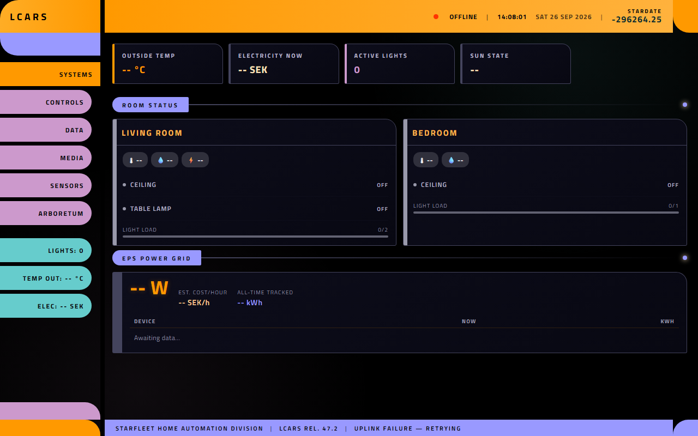
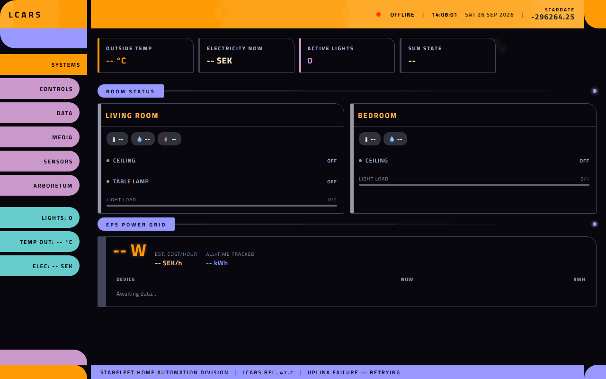

### Pip-Boy 3000 — Fallout
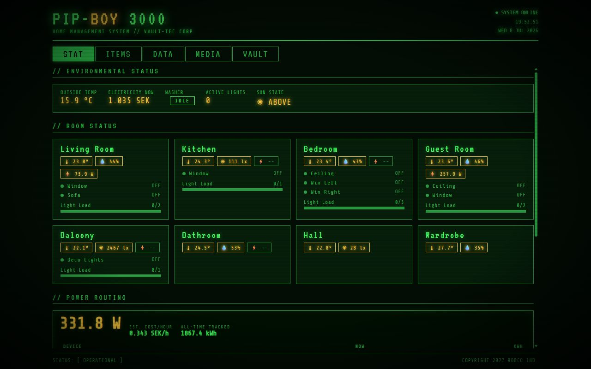
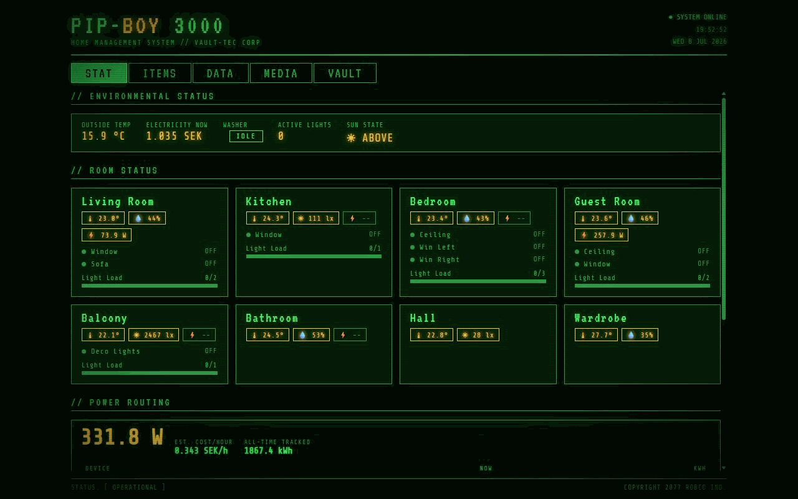

### Commodore 64
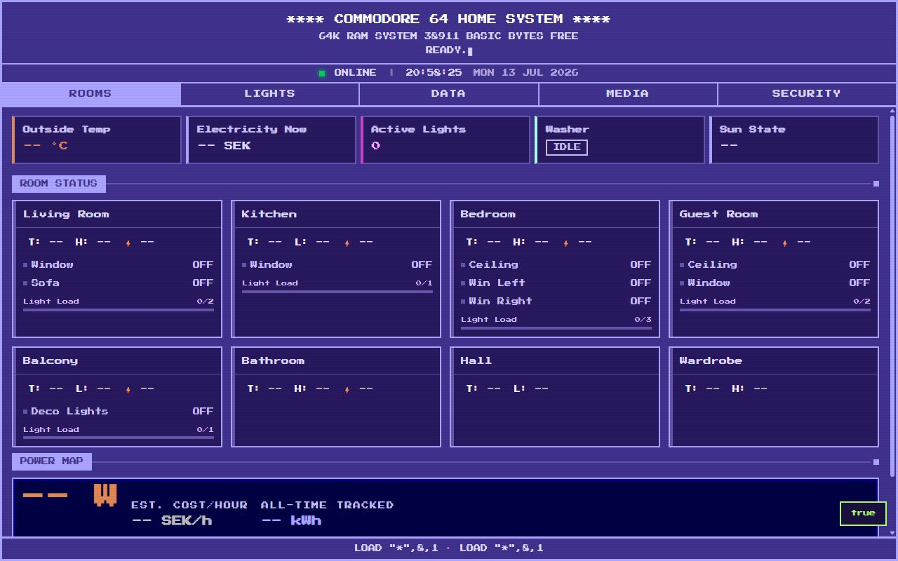
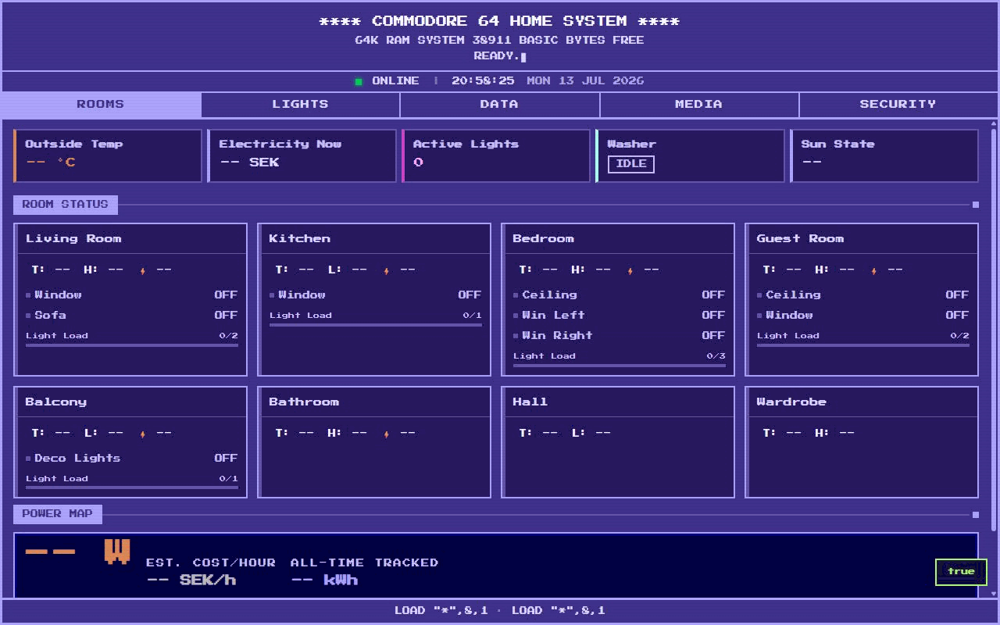

### Matrix
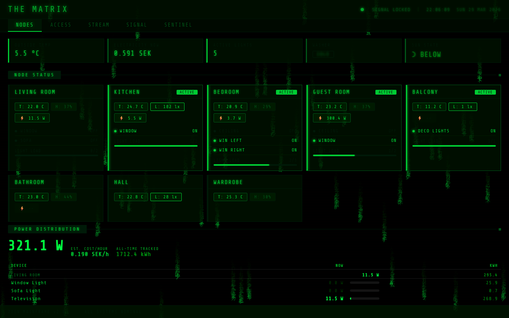
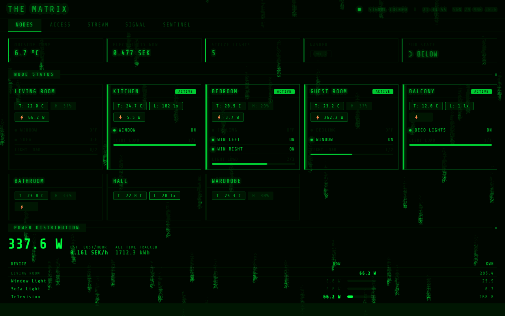

### Weyland-Yutani — Alien
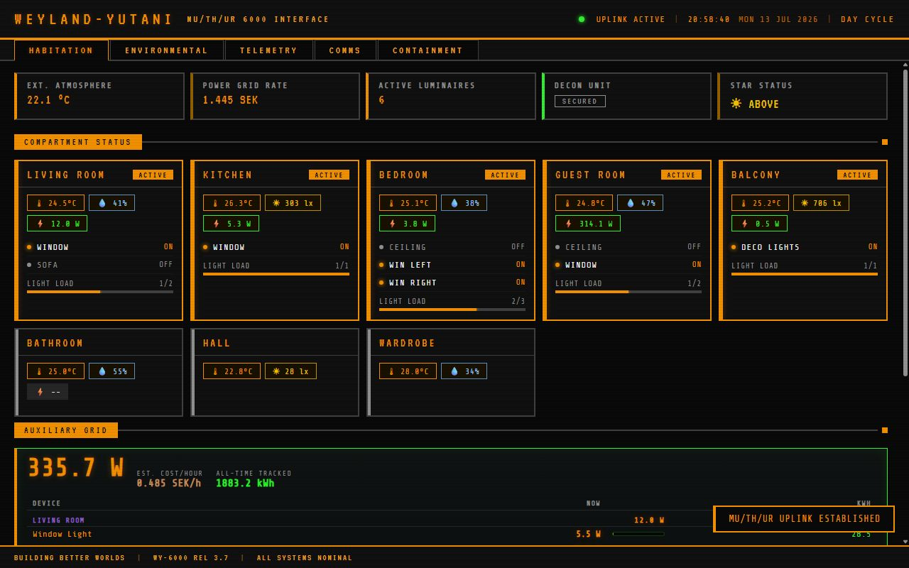
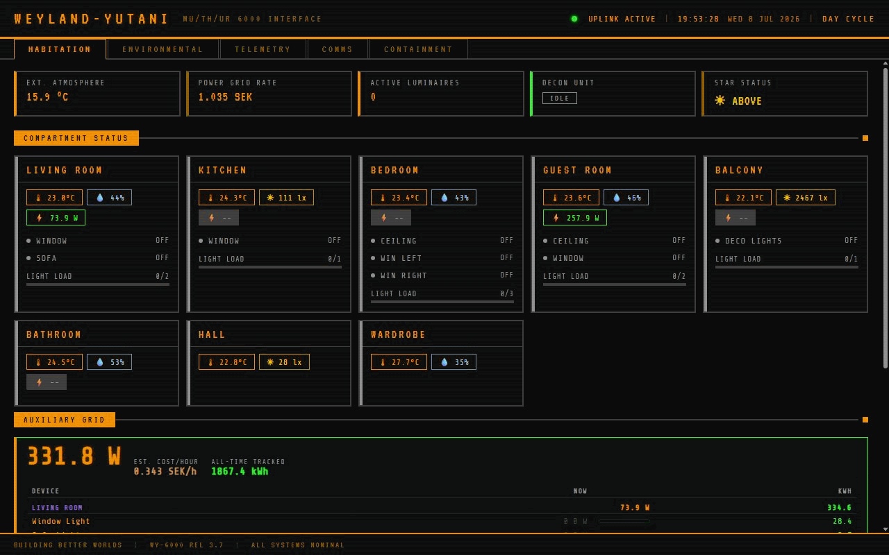

### Diablo IV — Sanctuary
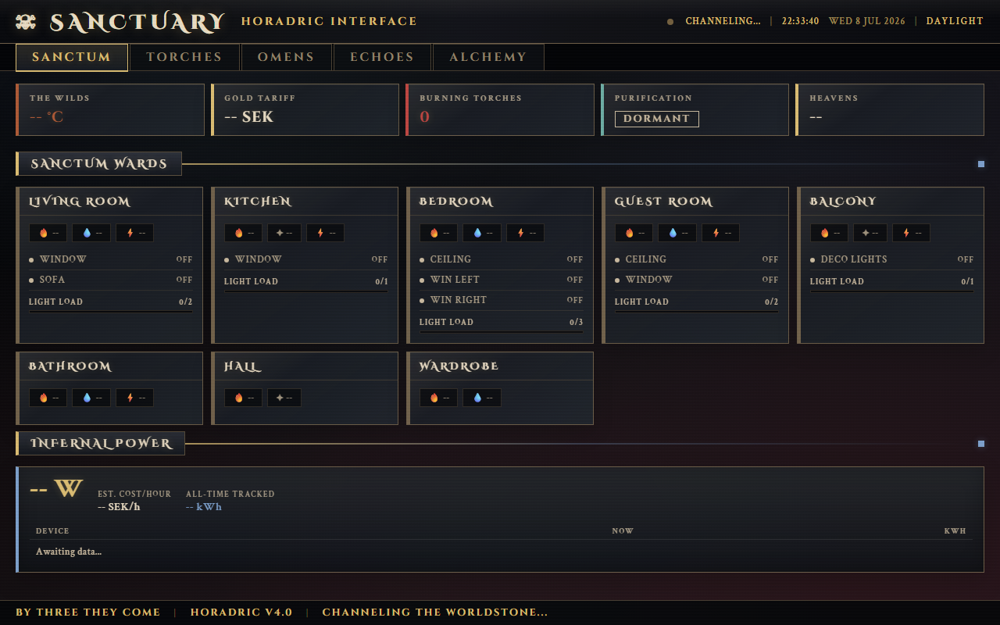
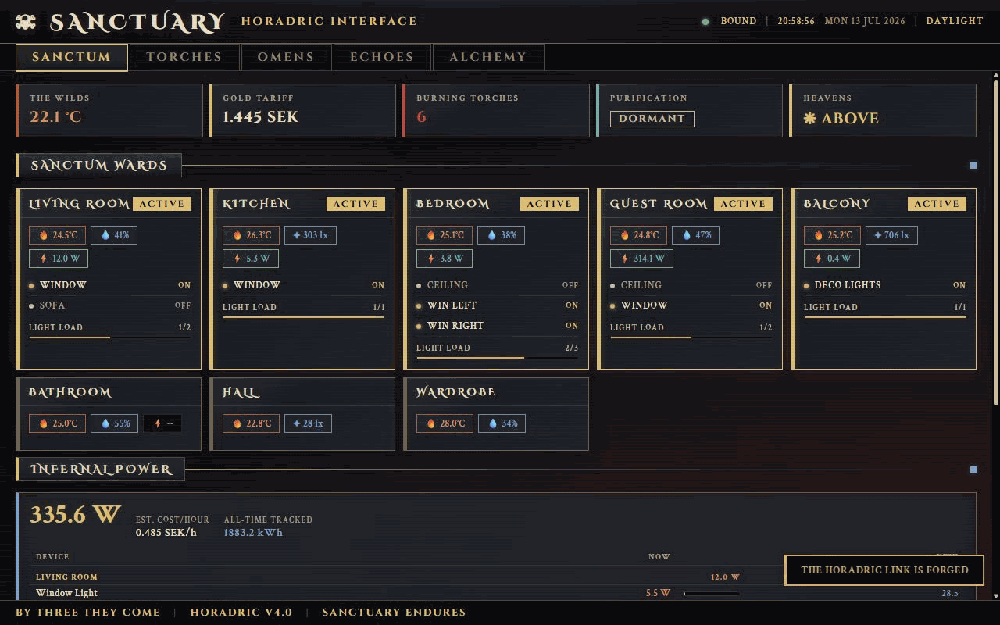

### Winamp 2.x
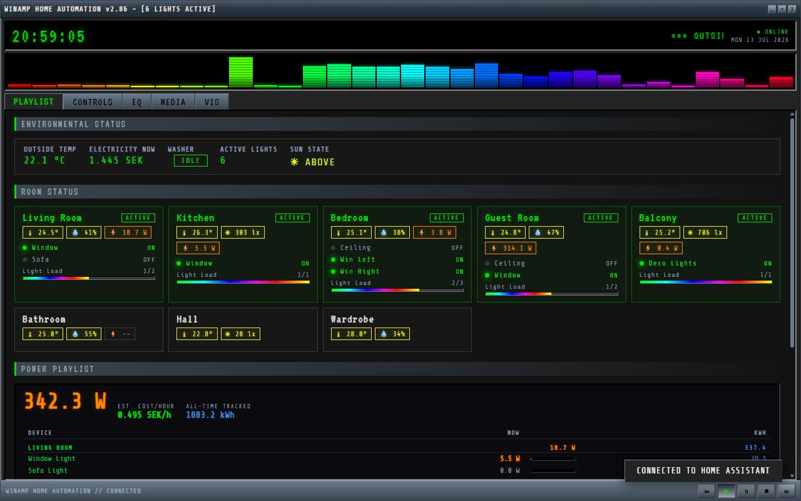
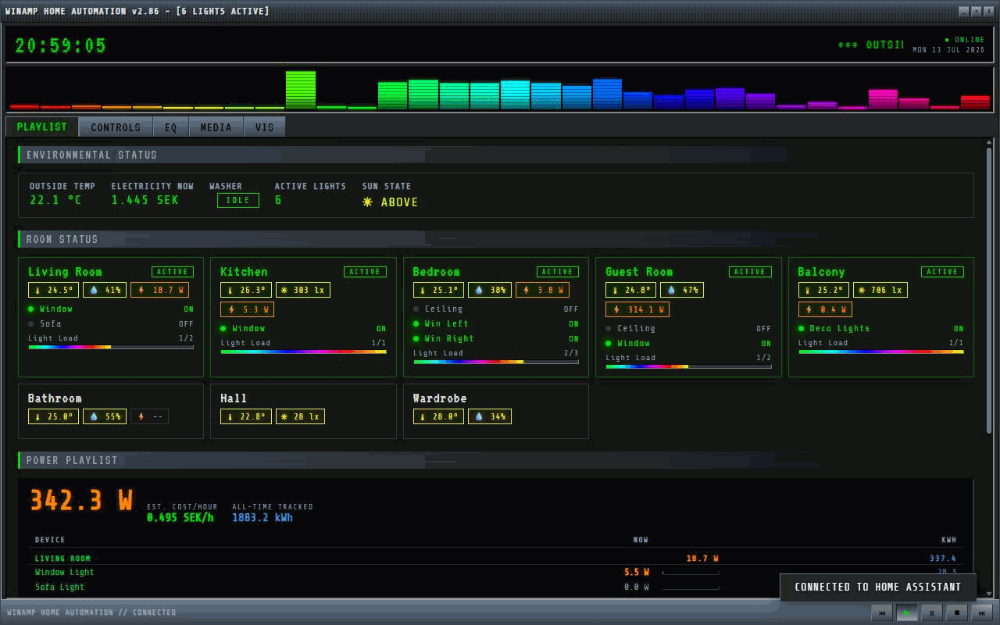

### Theme-Specific Extras
- **LCARS**: Animated radar sweep on the Sensors tab with randomized blip contacts
- **Pip-Boy**: Geiger counter that ticks based on ambient lux, plus a threat assessment panel
- **C64**: BASIC-style system log on the Security tab that logs events as numbered BASIC lines
- **Matrix**: Digital rain canvas background that responds to total power usage and slows at night
- **Weyland**: MOTHER AI status readout panel showing atmospheric, life support, and power diagnostics
- **Diablo IV**: Worldstone terminal readout with Cinzel Decorative font and blood-red/gold color scheme
- **Winamp**: 32-bar spectrum analyzer mapped to real sensors (power, temperature, humidity, lux), EQ-style vertical dimmer sliders, transport controls (play/pause/stop for spectrum, prev/next for tabs), LED marquee with scrolling live data, and rainbow graph mode for all charts

## Quick Start

### 1. Create your config files

```bash
cp config.js.example config.js
cp entities.js.example entities.js
```

Edit `config.js` with your Home Assistant connection:

```js
const HA_HOST  = '192.168.1.30:8123';            // Your HA IP:port (see mDNS note below)
const HA_TOKEN = 'YOUR_LONG_LIVED_ACCESS_TOKEN'; // Generate in HA → Profile → Long-Lived Access Tokens
const DEV_MODE = true;                           // Cache busting (set false for production)
```

Edit `entities.js` with your entity IDs. This is the **only file** you need to customize for your home. It defines your rooms, sensors, lights, media players, and integrations:

```js
const ENTITIES = {
  rooms: [
    {
      id: 'living', name: 'Living Room',
      sensors: { temp: 'sensor.your_temp', humidity: 'sensor.your_humidity', lux: null },
      lights: [
        { id: 'light.your_light', label: 'Ceiling', dimmable: true },
      ],
      power: [
        { sensor: 'sensor.your_plug_power', kwh: 'sensor.your_plug_kwh', label: 'Ceiling Light' },
      ],
    },
    // ... more rooms
  ],
  mediaPlayers: [ /* your Sonos/Apple TV entities */ ],
  integrations: {
    sun: 'sun.sun',
    weather: 'weather.your_weather_entity',
    nordpool: null,    // set to null if you don't use Nordpool
    tautulli: null,    // set to null if you don't use Plex/Tautulli
    washer: null,      // set to null if you don't have a smart washer
    // ... see entities.js.example for all options
  },
};
```

> Find your entity IDs in **HA → Developer Tools → States**. Set any integration to `null` to disable it — the dashboard will gracefully hide those sections.

> **mDNS warning**: Use your Home Assistant's **IP address**, not `homeassistant.local`. Android 12+ added mDNS `.local` support, but it silently breaks if **Private DNS** is enabled (Settings → Network → Private DNS) — a common default on Samsung tablets. Older Android versions lack `.local` support entirely. The WebSocket connection will silently fail and dashboards will show "Awaiting data..." with no error. Find your HA IP with `ping homeassistant.local` on a desktop.

### 2. Copy files to Home Assistant

Copy all `.html` files, `.js` files, and your config to your Home Assistant `www` folder:

```
/config/www/
├── config.js              ← Your HA connection (gitignored)
├── entities.js            ← Your entity IDs (gitignored)
├── shared.js              ← Common JS (all dashboards need this)
├── washer.js              ← Washer module (optional)
├── lcars-dashboard.html
├── pipboy-dashboard.html
├── c64-dashboard.html
├── matrix-dashboard.html
├── weyland-dashboard.html
├── diablo-dashboard.html
└── winamp-dashboard.html
```

### 3. Access the dashboards

Open any dashboard in your browser:

```
http://<your-ha-ip>:8123/local/lcars-dashboard.html
```

## Configuration

### config.js

Connection settings (host, token, dev mode):

| Variable | Description | Example |
|----------|-------------|---------|
| `HA_HOST` | Home Assistant IP and port (use IP, not `.local` — see [mDNS note](#1-create-your-config-file)) | `192.168.1.30:8123` |
| `HA_TOKEN` | Long-lived access token | Generate in HA → Profile → Security → Long-Lived Access Tokens |
| `HA_WS` | WebSocket URL (auto-derived) | `ws://192.168.1.30:8123/api/websocket` |
| `HA_BASE` | HTTP base URL (auto-derived) | `http://192.168.1.30:8123` |

> **Security**: `config.js` contains your access token and is listed in `.gitignore`. Never commit it. Share `config.js.example` instead.

### THEME object

Each dashboard defines a `THEME` constant in an inline `<script>` block that controls display strings, element mappings, and callback hooks:

```js
const THEME = {
  title: 'LCARS',                          // Header title
  subtitle: 'HOME AUTOMATION SYSTEM',      // Header subtitle
  footer: 'STARFLEET HOME AUTOMATION...',  // Footer text
  tabs: ['SYSTEMS', 'CONTROLS', ...],      // Tab labels
  tabIds: ['systems', 'controls', ...],    // Tab page IDs
  emptyMedia: 'No Active Transmissions',   // Shown when no media is playing
  connOnline: 'ONLINE',                    // Connection status labels
  connOffline: 'OFFLINE',
  connConnecting: 'CONNECTING',
  connToast: 'LCARS UPLINK ESTABLISHED',   // Toast shown on connect
  footerOnline: 'ALL SYSTEMS NOMINAL',     // Footer status messages
  footerConnecting: 'ESTABLISHING UPLINK...',
  footerOffline: 'UPLINK FAILURE — RETRYING',
  // Sensor formatting
  sensors: { temp: {icon:'🌡 ', unit:'°C'}, hum: {icon:'💧 ', unit:'%'}, lux: {icon:'☀ ', unit:' lx'} },
  dimmerColors: { fill: '--orange', bg: '--grey' },
  // Element ID mappings
  clockEl: 'clock-lcars',
  dateEl: 'date-lcars',
  lightCountEls: ['stat-lights', 'sb-lights'],
  nightToast: 'DECK LIGHTS — STANDBY',
  toastArrow: '→',
  // Callback hooks (optional)
  onInit() { /* runs after shared.js loads */ },
  onStatesLoaded() { /* runs after initial get_states */ },
  onIngest(id, s) { /* runs per state change */ },
};
```

Edit these values to customize text, formatting, and behavior without touching shared logic.

## Dashboard Structure

Each dashboard is an HTML file with inline CSS and a `THEME` config, plus `shared.js` for all common logic. No build tools needed.

### Script Load Order

```html
<script src="config.js"></script>     <!-- HA connection secrets -->
<script src="entities.js"></script>   <!-- Your rooms, sensors, lights, integrations -->
<script>
  const THEME = { ... };              <!-- Theme config + hooks -->
  // Theme-specific functions (e.g. renderLrs, initRain, renderMother)
</script>
<script src="shared.js"></script>     <!-- All shared logic (derives config from ENTITIES) -->
<script src="washer.js"></script>     <!-- Washer module (enabled via ENTITIES.integrations.washer) -->
```

Theme-specific functions can reference `shared.js` globals (`liveData`, `rooms`, etc.) because they are defined but not called until after `shared.js` loads.

### Dev Mode

`DEV_MODE` is set in `config.js`. When `true`, the page reloads with a cache-busting parameter (`?_cb=...`) so the browser always fetches fresh JS files. Set to `false` for production use — cached files load faster and reduce network requests.

### Feature Flags

Features are controlled via `ENTITIES.integrations` in `entities.js`. Set any integration to `null` to disable it:

```js
// entities.js
integrations: {
  nordpool: null,     // Disables electricity price charts
  tautulli: null,     // Disables Plex session tracking
  washer: null,       // Disables washer panel (or { enabled: false, ... })
}
```

When `FEATURES.washer` is `false`, all washer-related WebSocket subscriptions, state ingestion, and rendering are skipped — even if `washer.js` is loaded. This makes it safe to leave the script tag in place and toggle the feature with a single flag.

| Flag | Default | Effect |
|------|---------|--------|
| `washer` | `true` | Enables washer panel, status badge, entity subscriptions, and monthly statistics |

#### How feature hiding works

Dashboard HTML elements use a `data-feature` attribute to mark which feature they belong to:

```html
<div class="status-block teal" data-feature="washer">...</div>
<div data-feature="washer">
  <div class="section-title">...</div>
  <div id="washer-panel"></div>
</div>
```

At init time, `shared.js` hides all elements for disabled features with a single query:

```js
document.querySelectorAll(`[data-feature="${feature}"]`).forEach(el => {
  el.style.display = 'none';
});
```

This approach is theme-agnostic — each dashboard keeps its own wrapper classes and structure, the `data-feature` attribute is the only contract between HTML and the hiding logic. New features can reuse the same pattern by adding their own `data-feature` value.

### Tabs (5 per dashboard)

| Tab | Content |
|-----|---------|
| **Systems/Rooms** | Room cards with temperature, humidity, lux, power usage (W), light on/off counts, plus Power Distribution panel |
| **Controls/Lights** | Light toggle switches with dimmer sliders for supported lights, plus "all lights off" button |
| **Data** | Weather forecast, Nordpool electricity price charts (48h + bar chart), temperature history graph |
| **Media** | Plex session details (active streams, bandwidth, transcoding), Sonos/Apple TV now playing with album art and progress bars |
| **Sensors** | Energy consumption vs. price chart, washer panel (live status + monthly stats), plus theme-specific unique panels |

### Room Configuration

Rooms are defined in the `rooms` array. Each room object:

```js
{
  id: 'livingroom',
  name: 'Living Room',
  sensors: {
    temp: 'sensor.livingroomwindow_temperature',    // Temperature entity ID
    humidity: 'sensor.livingroomwindow_humidity',    // Humidity entity ID (null if none)
    lux: null                                        // Illuminance entity ID (null if none)
  },
  lights: [
    { id: 'light.livingroomwindow', label: 'Window' },
    { id: 'light.livingroomsofa', label: 'Sofa' }
  ],
  powerSensors: [                                    // Power consumption entities
    'sensor.livingroomwindow_power',
    'sensor.livingroomsofa_power',
    'sensor.livingroomwallplugtelevision_power'
  ]
}
```

### Adding a Room

1. Add a room object to the `rooms` array in `shared.js`
2. Add any new light entity IDs to `LIGHT_ENTITIES` in `shared.js`
3. Add any new sensor entity IDs to `ALL_SENSOR_IDS` in `shared.js`
4. Add power sensor initial values to `liveData.power` in `shared.js`

### Adding a Light

1. Add the entity ID to the room's `lights` array with a label
2. Add it to `LIGHT_ENTITIES` in `shared.js`
3. If dimmable, add it to the `DIMMABLE` Set in `shared.js`

### Media Players

Media players are defined in `MEDIA_PLAYER_ENTITIES` in `shared.js`:

```js
const MEDIA_PLAYER_ENTITIES = [
  { id: 'media_player.livingroom',   label: 'Living Room',  type: 'SONOS' },
  { id: 'media_player.kitchen',      label: 'Kitchen',      type: 'SONOS' },
  { id: 'media_player.bathroom',     label: 'Bathroom',     type: 'SONOS' },
  { id: 'media_player.livingroomtv', label: 'Living Room',  type: 'ATV' },
];
```

The media tab combines Plex sessions (via `sensor.plex_*` entities) with these media players under a unified "Now Playing" section. "No transmission" only shows when neither Plex, Sonos, nor Apple TV are active.

## Entity Reference

### Required Entities

These Home Assistant entities must exist for full functionality:

**Environment:**
- `sensor.openweathermap_temperature` — Outside temperature
- `weather.openweathermap` — Weather forecast

**Nordpool (electricity prices):**
- `sensor.nordpool_current_price_15m` — Current price (displayed in status bar)
- `sensor.nordpool_last_this_next_hour` — Last/current/next hour prices
- `sensor.nordpool_next_24h_15m` — 48h price forecast for charts
- These are from the standard [Nordpool HA integration](https://www.home-assistant.io/integrations/nordpool/). Entity names vary by setup — adjust in the `ingestState()` function if yours differ

**Sun:**
- `sun.sun` — Day/night state (drives night mode)

**Plex:**
- `sensor.plex_*` — Plex media server sensors

**Washer (Samsung SmartThings):**
- `sensor.washer_job_state` — Current cycle phase (wash, rinse, spin, finish, none)
- `sensor.washer_machine_state` — Machine state (run, stop, pause)
- `sensor.washer_completion_time` — ETA timestamp
- `select.washer_water_temperature` — Selected wash temperature
- `select.washer_spin_level` — Selected spin speed (RPM)
- `number.washer_rinse_cycles` — Number of rinse cycles
- `sensor.washer_power` — Real-time power draw (W)
- `sensor.washer_energy` — Lifetime energy (kWh, used for monthly statistics)
- `sensor.washer_water_consumption` — Lifetime water (L, used for monthly statistics)
- `sensor.washer_cycle_count` — Wash cycle counter (requires counter helper + automation, see [Washer Panel → Cycle counting setup](#cycle-counting-setup))

**Power (per-room):**
- `sensor.*_power` — Smart plug power sensors

### Rooms (Default Configuration)

| Room | Lights | Sensors | Power Sensors |
|------|--------|---------|---------------|
| Living Room | Window, Sofa | Temp, Humidity | 3 plugs |
| Kitchen | Window | Temp, Lux | 1 plug |
| Bedroom | Ceiling*, Win Left, Win Right | Temp, Humidity | 3 plugs |
| Guest Room | Ceiling*, Window | Temp, Humidity | 3 plugs |
| Balcony | Deco Lights | Temp, Lux | 1 plug |
| Bathroom | — | Temp, Humidity | 1 plug (Washer) |
| Hall | — | Temp, Lux | — |
| Wardrobe | — | Temp, Humidity | — |

\* = Dimmable

## Features

### Night Mode

All dashboards respond to `sun.sun` state. When the sun is below the horizon:
- **LCARS**: Sidebar and bars shift to cooler purple/blue tones
- **Pip-Boy**: Subtle scanline and flicker adjustments
- **C64**: Semi-transparent dark overlay
- **Matrix**: Green palette dims, rain speed halves
- **Weyland**: Header shows "NIGHT WATCH" instead of "DAY CYCLE"
- **Diablo IV**: Gold and crimson tones dim to muted bronze
- **Winamp**: Chrome bevels darken, spectrum analyzer dims

### "All Lights Off" Button

Each dashboard has a themed button on the Controls/Lights tab that turns off all lights except the Balcony:

| Theme | Button Label |
|-------|-------------|
| LCARS | DECK LIGHTS — STANDBY |
| Pip-Boy | VAULT CURFEW |
| C64 | POKE >D020,00 |
| Matrix | DISCONNECT NODES |
| Weyland | CREW HIBERNATION |
| Diablo IV | ETERNAL DARKNESS |
| Winamp | LIGHTS OUT |

### Power Distribution Panel

The Systems tab includes a Power Distribution panel showing real-time power consumption across all monitored devices. It displays:

- **Total watts**: Live aggregate power draw across all rooms
- **Estimated cost/hour**: Based on current Nordpool electricity price
- **All-time tracked kWh**: Cumulative energy from all device kWh sensors
- **Device table**: Grouped by room, showing per-device watts with power bars, room totals, and cumulative kWh

Power data comes from Z-Wave smart plug sensors (`sensor.*_power` for live watts, `sensor.*_electric_consumption_kwh` for cumulative energy). The panel updates in real-time via WebSocket state changes.

### Washer Panel

The Sensors tab includes a washer status panel powered by Samsung SmartThings entities. Set `integrations.washer` to `null` in `entities.js` to disable it entirely — the panel hides gracefully.

#### What it shows

- **Live status**: current cycle phase with animated progress indicator (e.g. WASH → RINSE → SPIN)
- **ETA countdown**: time remaining and estimated completion timestamp, auto-updates every second during active cycles
- **Cycle settings**: water temperature, spin speed (RPM), rinse count, real-time power draw (W) — shown only during active cycles
- **Monthly statistics**: energy (kWh) and water (L) bar charts per month, grouped by year, with cycle counts
- **Yearly totals**: aggregated energy, water, and cycle count per year
- **Lifetime totals**: all-time cumulative energy (kWh), water (L), and cycle count

Monthly and yearly stats use HA's `recorder/statistics_during_period` API with `period: 'month'`, fetching the last ~2 years of data. Statistics accumulate indefinitely in HA's recorder database.

#### Required entities

Configure these in `entities.js` under `integrations.washer`. All entity IDs come from the Samsung SmartThings integration:

| Config Key | Entity ID Example | Type | What it provides |
|------------|-------------------|------|------------------|
| `jobState` | `sensor.washer_job_state` | sensor | Current cycle phase: `none`, `wash`, `rinse`, `spin`, `finish` |
| `machState` | `sensor.washer_machine_state` | sensor | Machine state: `run`, `stop`, `pause` |
| `completion` | `sensor.washer_completion_time` | sensor | ISO 8601 timestamp of estimated completion |
| `power` | `sensor.washer_power` | sensor | Real-time power draw in watts |
| `energy` | `sensor.washer_energy` | sensor | Lifetime energy in kWh (`state_class: total_increasing`) |
| `water` | `sensor.washer_water_consumption` | sensor | Lifetime water in liters (`state_class: total_increasing`) |
| `cycles` | `sensor.washer_cycle_count` | sensor | Lifetime wash cycle count (requires helper, see below) |
| `waterTemp` | `select.washer_water_temperature` | select | Selected wash temperature (e.g. "40", "60") |
| `spinLevel` | `select.washer_spin_level` | select | Selected spin speed (e.g. "800", "1200") |
| `rinses` | `number.washer_rinse_cycles` | number | Number of rinse cycles selected |

#### Expected entity values

The dashboard interprets these state values to drive the UI:

**`jobState`** — determines which phase indicator is active:
- `none` → idle (panel shows "STANDBY")
- `wash` → washing phase active
- `rinse` → rinsing phase active
- `spin` → spinning phase active
- `finish` → cycle complete (panel shows completion message)
- Any other value → treated as active/unknown phase

**`machState`** — determines the status badge in the environment bar:
- `run` → badge shows "RUNNING" (green)
- `pause` → badge shows "PAUSED" (yellow)
- `stop` → badge shows "IDLE"

**`completion`** — must be an ISO 8601 timestamp (e.g. `2026-03-29T22:30:00+01:00`). The dashboard calculates remaining time from this. If the timestamp is in the past or missing, the ETA section is hidden.

**`energy` / `water`** — must have `state_class: total_increasing` for HA's recorder to track monthly statistics. Without this, the monthly bar charts will be empty.

#### Cycle counting setup

The SmartThings integration does not expose a cycle counter. To track cycles per month, create three things in Home Assistant:

**1. Counter helper** (`configuration.yaml`):
```yaml
counter:
  washer_cycles:
    name: Washer Cycles
    initial: 0
    step: 1
```

**2. Template sensor** (`configuration.yaml` under `template:`):
```yaml
template:
  - sensor:
      - name: "Washer Cycle Count"
        unique_id: washer_cycle_count
        state: "{{ states('counter.washer_cycles') | int(0) }}"
        state_class: total_increasing
        unit_of_measurement: "cycles"
```

The `state_class: total_increasing` is critical — it tells HA's recorder to track long-term statistics, which is what the dashboard reads via `recorder/statistics_during_period`.

**3. Automation** (UI or `automations.yaml`):
```yaml
- alias: "Count washer cycles"
  trigger:
    - platform: state
      entity_id: sensor.washer_job_state
      to: "wash"
  condition:
    - condition: template
      value_template: "{{ trigger.from_state.state != 'wash' }}"
  action:
    - service: counter.increment
      target:
        entity_id: counter.washer_cycles
```

After creating these, restart Home Assistant (not just "Reload YAML" — counters are only created at boot). Statistics start accumulating from the moment the template sensor is created.

#### Theme labels

Each theme uses its own names for the washer panel and cycle phases:

| Theme | Panel Title | Phase Names |
|-------|------------|-------------|
| LCARS | TEXTILE RECYCLER | SCAN → WASH → RINSE → SPIN → COMPLETE |
| Pip-Boy | DECON UNIT | DETECT → WASH → RINSE → SPIN → CLEAR |
| C64 | WASHER 1541-W | LOAD → WASH → RINSE → SPIN → READY. |
| Matrix | CLEANSER | SENSE → PURIFY → FLUSH → EXTRACT → EXIT |
| Weyland | DECON BAY 3 | WEIGH → DECON → RINSE → EXTRACT → SECURED |
| Diablo IV | PURIFICATION | SENSE → CLEANSE → PURGE → WRING → SANCTIFIED |
| Winamp | LAUNDRY | DETECT → WASH → RINSE → SPIN → DONE |

Customize labels via `THEME.washer` in each dashboard's inline script.

### Weather Forecast Popup

Clicking any weather forecast card on any dashboard opens a detailed popup showing:
- Hero display with temperature, condition icon, and time
- Wind speed and direction, precipitation total, humidity, cloud coverage, temperature range
- Hourly breakdown of all 24 forecast hours with condition, temperature, rain, and wind

The popup inherits each dashboard's theme colors via CSS variables.

### Chart Reference Grid Lines

All dashboards display reference grid lines on charts for quick value reading:
- **Nordpool 48h**: horizontal lines at 1, 2, 3 SEK
- **Energy Consumption**: horizontal lines at 1, 2, 3 SEK
- **Temperature 24h**: horizontal lines at 5°C intervals (5°, 10°, 15°, etc.)

### Theme Switcher & Fullscreen

Press the **lower-left corner** of any dashboard to reveal a hidden menu:
- **Theme switcher** — links to all 7 dashboards
- **Fullscreen toggle** — uses the browser Fullscreen API

The controls auto-hide after 20 seconds of inactivity.

### Fullscreen & Kiosk Mode

The built-in fullscreen button uses the browser Fullscreen API, which works well on desktop but has limitations on tablets and wall-mounted displays:

- **Android tablets**: Chrome exits fullscreen on page navigation (switching themes) and after screen timeout/wake. The status bar and navigation bar reappear.
- **iPads**: Safari doesn't support the Fullscreen API at all. The button does nothing.
- **Wall panels**: A browser crash or reboot leaves you at the home screen instead of the dashboard.

**Recommended: [Fully Kiosk Browser](https://www.fully-kiosk.com/)** (Android, ~$7 one-time)

Fully Kiosk solves all of these problems. It locks the device into a true fullscreen kiosk mode with no status bar, no navigation bar, and auto-restart on crash. Recommended settings:

| Setting | Value | Why |
|---------|-------|-----|
| Start URL | `http://<your-ha-ip>:8123/local/lcars-dashboard.html` | Opens your preferred theme on boot (use IP, not `.local`) |
| Enable Fullscreen | On | Hides Android status bar and nav bar |
| Enable Kiosk Mode | On | Prevents users from leaving the app |
| Keep Screen On | On | Prevents screen timeout (or set a schedule) |
| Screensaver | Dimmed screen or black | Reduces burn-in on always-on displays |
| Motion Detection | On (optional) | Wakes screen when someone walks by |
| Restart on Crash | On | Auto-recovers from browser crashes |
| Restart on Idle | Off (or set hours) | Optional nightly restart for memory cleanup |
| JavaScript Errors | Ignore | Prevents error popups from blocking the UI |

> **Tip**: Fully Kiosk also exposes a REST API you can integrate with Home Assistant to remotely control screen brightness, reload pages, or wake the display via automations.

### PWA / Add to Home Screen

All dashboards include `mobile-web-app-capable` meta tags. On mobile:
1. Open the dashboard in Chrome
2. Menu → "Add to Home Screen"
3. The dashboard launches without browser chrome

> **Note**: PWA mode on Android still shows the status bar. For a truly immersive panel experience, use Fully Kiosk Browser instead (see above).

### Accessibility (WCAG 2.2 AA)

- Skip-to-content link on all dashboards
- `role="tablist"` and `aria-selected` on navigation tabs
- Keyboard-navigable tabs
- `focus-visible` outlines on all interactive elements
- `aria-live="polite"` on toast notifications
- `prefers-reduced-motion` media query disables animations
- **Winamp** keyboard shortcuts: Space (play/pause), S (stop), Arrow Left/Right (prev/next tab)

## Adapting for Your Home

### Step-by-step

1. **Copy `config.js.example` to `config.js`** — add your HA host and token
2. **Copy `entities.js.example` to `entities.js`** — this is the main file to customize:
   - **Rooms**: add/remove rooms, set sensor entity IDs, define lights (mark `dimmable: true` where supported), add power monitors
   - **Media players**: add your Sonos/Apple TV/Chromecast entities
   - **Integrations**: enable/disable Nordpool, Plex, washer, weather by setting entities or `null`
3. **Customize THEME** (optional) — change tab names, titles, and status messages in each dashboard HTML

> **Note**: `LIGHT_ENTITIES`, `ALL_SENSOR_IDS`, `DIMMABLE`, and all power config arrays are **auto-derived** from your rooms config. You only edit `entities.js` — `shared.js` builds everything else automatically.

### Creating a New Theme

1. Copy any existing dashboard HTML file
2. Update the CSS variables in `:root { }` for your color scheme
3. Change fonts (loaded via Google Fonts `@import`)
4. Edit the `THEME` object for your labels, sensor formatting, element IDs, and hooks
5. Add theme-specific functions (e.g. custom animations, unique panels)
6. Modify the HTML header/footer structure
7. Update the `.active` class in the theme switcher menu

### Adding a New Tab

All themes use the same 5 standard tab IDs (`systems`, `controls`, `data`, `media`, `sensors`) with theme-specific display names. To add a 6th tab:

**1. Add the tab button** in the HTML `<div role="tablist">`:

```html
<button class="tab" role="tab" aria-selected="false" aria-controls="page-network"
  tabindex="-1" onclick="switchTab('network')">NETWORK</button>
```

**2. Add the tab page** as a new `<div class="page">` section:

```html
<div class="page" id="page-network">
  <div class="section-title">NETWORK STATUS</div>
  <div id="network-content">
    <!-- Your content here -->
  </div>
</div>
```

**3. Register the tab** in the `THEME` object:

```js
const THEME = {
  tabs: ['SYSTEMS', 'CONTROLS', 'DATA', 'MEDIA', 'SENSORS', 'NETWORK'],
  tabIds: ['systems', 'controls', 'data', 'media', 'sensors', 'network'],
  // ...
};
```

**4. Add rendering logic** (optional) — add a render function in the dashboard's inline `<script>` and hook it into `onStatesLoaded` or `onStateChanged`:

```js
function renderNetwork() {
  const el = document.getElementById('network-content');
  if (!el) return;
  el.innerHTML = '...'; // Your rendering logic
}

// In THEME hooks:
onStatesLoaded() { renderNetwork(); },
onStateChanged(id, s) { if (id.includes('unifi')) renderNetwork(); },
```

Repeat steps 1-3 for each theme dashboard you want the tab in. The tab ID must match across all themes; the display name can be different per theme.

## File Structure

```
├── config.js              ← Your HA connection (gitignored)
├── config.js.example      ← Template for config.js
├── entities.js            ← Your rooms, sensors, lights, integrations (gitignored)
├── entities.js.example    ← Template for entities.js
├── shared.js              ← Common JS: state, render, WS, init (derives config from entities.js)
├── washer.js              ← Washer module: state, rendering, stats
├── .gitignore             ← Excludes config.js and entities.js
├── lcars-dashboard.html   ← Star Trek LCARS theme
├── pipboy-dashboard.html  ← Fallout Pip-Boy theme
├── c64-dashboard.html     ← Commodore 64 theme
├── matrix-dashboard.html  ← Matrix digital rain theme
├── weyland-dashboard.html ← Alien Weyland-Yutani theme
├── diablo-dashboard.html  ← Diablo IV Sanctuary theme
├── winamp-dashboard.html  ← Winamp 2.x media player theme
├── tools/
│   ├── setup.html             ← Setup wizard (generates entities.js via browser UI)
│   ├── capture-gifs.py        ← Retake all 7 demo GIFs (requires Playwright)
│   └── capture-screenshots.py ← Retake all 7 system screenshots (requires Playwright)
└── README.md              ← This file
```

## Technical Details

### How It Works

`shared.js` connects to Home Assistant via **WebSocket API** (`ws://host:port/api/websocket`). On connection:

1. Authenticates with the long-lived access token
2. Subscribes to all entity state changes
3. Fetches initial states for all configured entities
4. Renders the UI and updates in real-time as states change

All state is tracked in a `liveData` object that maps entity IDs to their current values. Render functions read from `liveData` and update the DOM.

### Key Functions (in shared.js)

| Function | Purpose |
|----------|---------|
| `haConnect()` | Establishes WebSocket connection with auto-reconnect |
| `ingestState(s)` | Maps a HA state object into `liveData` |
| `renderRooms()` | Renders room cards with sensors, lights, and power |
| `renderMedia()` | Renders Plex sessions |
| `renderMediaPlayers()` | Renders Sonos/ATV players |
| `updateNoMediaMsg()` | Shows/hides "no media" message |
| `renderEnviro()` | Renders environment status bar |
| `renderWeather()` | Renders weather forecast cards |
| `renderNordpool48h()` | Renders 48-hour electricity price chart |
| `renderTempGraph()` | Renders temperature history sparkline |
| `renderLcEnergy()` | Renders energy consumption vs price |
| `renderPowerPanel()` | Renders power distribution table grouped by room with live watts, bars, and kWh |
| `renderWasher()` | Renders washer panel: live status, phase progress, monthly stats *(in washer.js)* |
| `toggleLight(id, on)` | Toggles a light and calls HA service |
| `dimLight(id, value)` | Sets brightness and calls HA service |
| `nightProtocol()` | Turns off all lights except Balcony |
| `updateDayNight()` | Toggles night-mode CSS class based on sun state |
| `setConnStatus(s)` | Updates connection status display |
| `showToast(msg)` | Shows temporary notification |

### THEME Hooks

Each dashboard defines a `THEME` object in an inline `<script>` before `shared.js` loads. Beyond styling properties, the THEME object supports callback hooks that `shared.js` calls at key lifecycle points:

| Hook | When it fires | Use case |
|------|--------------|----------|
| `onAuthOk()` | WebSocket authenticated successfully | Start theme animations, show connection UI |
| `onAuthFail()` | Authentication failed (bad token) | Show theme-specific error state |
| `onStatesLoaded()` | All initial entity states received and rendered | Initialize theme features that depend on data |
| `onStateChanged(id, s)` | A single entity state changed (real-time) | Update theme-specific panels (e.g. Matrix rain speed, Pip-Boy Geiger counter) |
| `onIngest(id, s)` | Called inside `ingestState()` for every entity | Store theme-specific data from entities |
| `onToggleLight(id, on)` | A light was toggled | Theme-specific toggle effects |
| `onNightProtocol()` | "All lights off" was triggered | Theme-specific night mode |
| `onWsError()` | WebSocket error occurred | Theme-specific error display |

### Performance Notes

- **Matrix rain**: Uses `setTimeout` at 150ms intervals (~6-7 fps) instead of `requestAnimationFrame` for minimal CPU usage
- **Canvas animations** (LCARS radar, C64 scanlines): Disabled automatically when `prefers-reduced-motion` is set
- All dashboards run entirely client-side with no external dependencies beyond Google Fonts

## Setup Wizard

Don't want to edit `entities.js` by hand? Use the setup wizard:

1. Open `tools/setup.html` in your browser (locally or via `http://your-ha:8123/local/tools/setup.html`)
2. Enter your HA host and token
3. The wizard connects to HA, discovers all your entities, and auto-detects rooms from light names
4. Configure rooms, sensors, media players, and integrations with dropdowns
5. Click "Generate entities.js" — copy or download the result

The wizard auto-detects Nordpool, Tautulli, washer, and weather integrations if they're installed.

## Troubleshooting

### "Missing config.js" or "Missing entities.js" error page

You see a full-page error instead of the dashboard.

**Fix**: Copy the example files and edit them:
```bash
cp config.js.example config.js
cp entities.js.example entities.js
```
Or use the [Setup Wizard](#setup-wizard) to generate `entities.js` automatically.

### Dashboard shows "OFFLINE" and never connects

- **Check your IP**: Make sure `HA_HOST` in `config.js` uses an IP address, not `homeassistant.local` (Android devices can't resolve `.local` with Private DNS enabled)
- **Check your token**: Regenerate your long-lived access token in HA → Profile → Security
- **Check the port**: Default is `8123` — make sure it's included
- **Check the browser console** (F12) for WebSocket errors

### Room cards show dashes (--) for temperature/humidity

Your sensor entity IDs in `entities.js` don't match what's in Home Assistant.

**Fix**: Open HA → Developer Tools → States, search for your sensors, and copy the exact `entity_id` into `entities.js`. After loading, check the browser console — the dashboard logs any entities it couldn't find.

### Electricity charts are empty

You don't have Nordpool installed, or the entity names don't match.

**Fix**: If you don't use Nordpool, set all three nordpool entries to `null` in `entities.js`:
```js
nordpool: null,
nordpoolExtra: null,
nordpool48h: null,
```
If you do use Nordpool, check your entity names in HA → Developer Tools → States → search "nordpool".

### Media tab always says "No Active Transmissions"

Either nothing is playing, or Tautulli/Plex isn't configured.

**Fix**: If you don't use Plex/Tautulli, set `tautulli: null` in `entities.js`. Media players (Sonos, Apple TV) are configured separately in `mediaPlayers` and should still show "Now Playing" when active.

### Washer panel is missing

The washer integration is disabled or not detected.

**Fix**: If you don't have a smart washer, set `washer: null` in `entities.js` — the panel hides gracefully. If you do have one, configure the entity IDs in `entities.js` under `integrations.washer` (see `entities.js.example` for the full list).

### Weather forecast cards are empty

The weather entity name doesn't match.

**Fix**: Find your weather entity in HA → Developer Tools → States → search "weather." and update `integrations.weather` in `entities.js`.

### Toast says "X entity ID(s) not found"

After connecting, the dashboard checks all configured entities against what HA returned. Open the browser console (F12) to see exactly which entities are missing and why (e.g. typo, renamed entity, removed device).

### Power Distribution shows 0 W for a room

The power sensor entity IDs are wrong or the smart plug is offline.

**Fix**: Check that the `sensor` field in each room's `power` array matches your actual Z-Wave/Zigbee plug entity ID. Also check the `kwh` field — the dashboard tries to auto-detect the pattern `*_power` → `*_electric_consumption_kwh`.

## License

MIT
